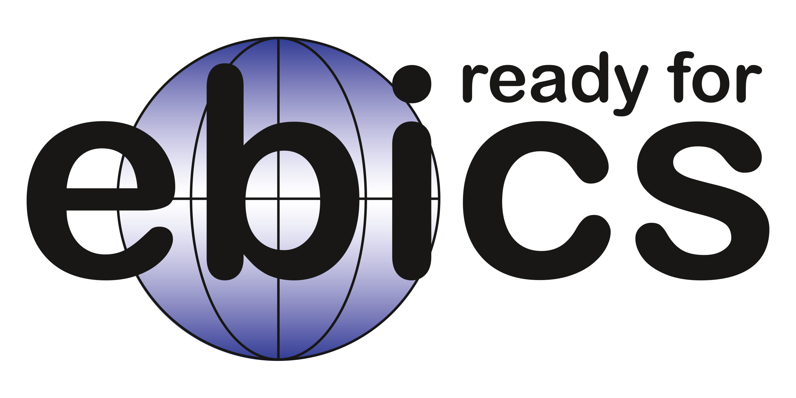

<div align="center">
	
	<h2>ALYF Banking</h2>
</div>

<div align="center">
<p><b>ALYF Banking</b> is a seamless solution for connecting your bank accounts with ERPNext.</p>

<p>This app is designed to simplify your financial management by effortlessly fetching transactions from thousands of banks and integrating them directly into your ERPNext system. Say goodbye to manual data entry and time-consuming reconciliations ✨</p>

<p>Experience the ease of automation and gain better control over your finances with the ultimate banking integration app for ERPNext users.</p>
</div>

<hr>
<b>Note</b>: Our improved Bank Reconciliation Tool is <b>free</b> to use and compatible with other bank integrations. The Bank Integration works with a paid subscription. Visit <a href="https://banking.alyf.de/banking-pricing">banking.alyf.de</a> to check out the pricing and sign up.
<hr>

## Documentation
Check out the [Banking Wiki](https://github.com/alyf-de/banking/wiki) for a step-by-step guide on how to use the app.

## Country and Bank Coverage



We use the EBICS protocol which is widely supported by banks in the following countries:

- 🇦🇹 Austria
- 🇫🇷 France
- 🇩🇪 Germany
- 🇨🇭 Switzerland

## Installation

Install [via Frappe Cloud](https://frappecloud.com/marketplace/apps/banking) or on your local bench:

```bash
bench get-app https://github.com/alyf-de/banking.git
bench --site <sitename> install-app banking
```

> [!TIP]
> You don't need to be concerned about testing this app, since it supports clean uninstallation.

## Customize

Ask the user for extra values before reconciling:

```js
frappe.ui.form.on("Bank Reconciliation Tool Beta", {
	before_reconcile: function (frm, transaction, selected_vouchers) {
		return new Promise((resolve, reject) => {
			frappe.prompt([
				{
					label: __("My Fieldname"),
					fieldname: "my_fieldname",
					fieldtype: "Data",
				},
			], (values) => {
				// {my_fieldname: "My Value"}
				resolve(values);
			});
		});
	},
});
```

Use the extra values in the `get_payment_entries` hook:

```python
from banking.overrides.bank_transaction import CustomBankTransaction


def get_payment_entries(
	bt: CustomBankTransaction,
	vouchers: list,
	reconcile_multi_party: bool = False,
	extra_params: dict | None = None,
	*args,
	**kwargs,
):
	"""Reconcile vouchers with the Bank Transaction.

	Accepts a bank transaction and a list of (unpaid) vouchers to reconcile.

	Returns a list of (paid) vouchers to add to the bank transaction.
	"""
	assert extra_params["my_fieldname"] == "My Value"

	return [
		{
			"payment_doctype": "Journal Entry",
			"payment_name": "JE-123",
			"amount": 100,
		},
		{
			"payment_doctype": "Payment Entry",
			"payment_name": "PE-123",
			"amount": 100,
		},
	]
```

In case you automatically create **Journal Entries** for **Bank Transactions** (e.g. to Cash In Transit), you can prevent them from showing up in **Bank Reconciliation Tool Beta** by using the **Bank Transaction**'s _ID_ (`name`) as the **Journal Entry**'s _Reference Number_ (`cheque_no`).

### SEPA Payment Order

DocTypes that map to **SEPA Payment Order** can provide a method `get_sepa_payment_amount` via controller or `doc_events` hook. This is called when the execution date is changed. The parameters are the reference row name and execution date. It should return the amount of the payment. The main use case for this is early payment discounts.

## Contribute

### Translations

In general, translations are managed using PO files in the `banking/locale/` directory. PO files exclude strings that are already translated in Frappe or ERPNext.

To update translation files, run the following commands:

```bash
# ERPNext v15 does not come with a pot file, but we need it to exclude existing translations.
bench generate-pot-file --app erpnext

# Generate POT file for Banking
bench generate-pot-file --app banking

# Update PO files from POT files
bench update-po-files --app banking
```
