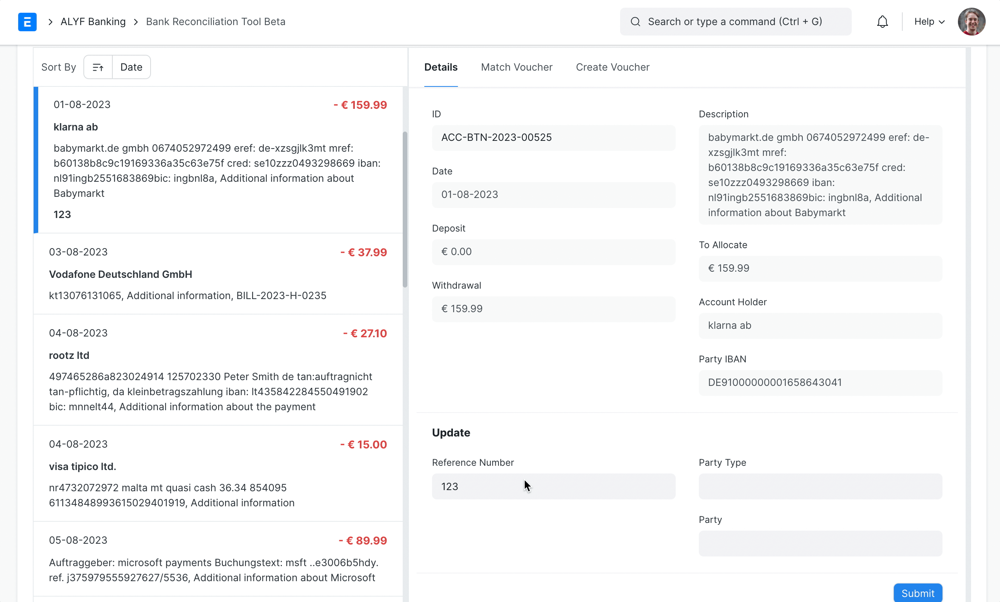
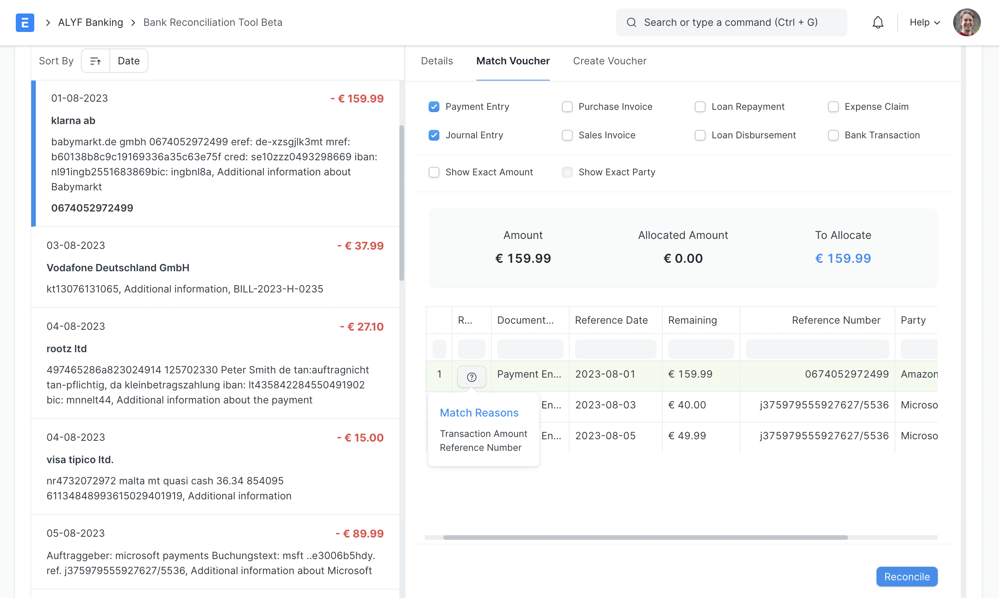
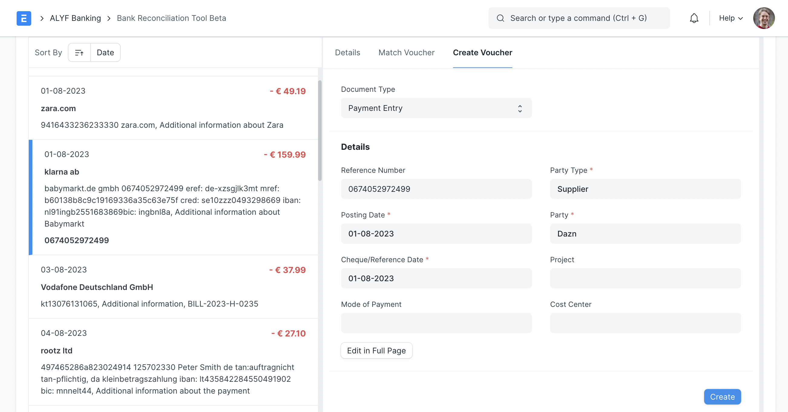

Once all your Bank Transactions are synced into ERPNext, you can reconcile them with your existing vouchers. On your workspace sidebar, **go to**:

> Accounting > ALYF Banking > Bank Reconciliation

Or simply search for **Bank Reconciliation Tool Beta** in the awesomebar.

Once you are on the tool:
- Select a Company and, optionally, a Bank Account
- You can also filter by Bank to show transactions across all accounts of that bank
- If no Bank Account is selected, each transaction row will display which account it belongs to
- Make sure that the opening balance from ERPNext matches the opening balance of your Bank Statement.
- Enter the Closing Balance of the Bank Statement.
- Enter the date range to fetch unreconciled bank transactions

Once all the filters are set click on **Get Bank Transactions**.

You will now see the Bank Transactions on your left and the actions to perform on each transaction on your right.

The Transactions can be sorted based on various parameters. To proceed click on any Bank Transaction entry and perform any of the following actions:

## Update Transaction Details

You can update the Reference Number, Party and Party Type of a Bank Transaction or refer to it from the **Details** tab.

Simply fill in the fields in the 'Update' section and click on **Submit** at the bottom of the panel.

## Reconcile a Transaction

You can determine which vouchers you want to match against your Bank Transaction by checking the right filters within the **Match Voucher** tab.

In the filters:
- **Purchase Invoice**: Fetches Purchase Invoices that have **Is Paid** checked. These are invoices that complete the payment cycle within the invoice itself (i.e. without a Payment Entry or Journal Entry against them).
- **Sales Invoice**: Fetches Sales Invoices against POS Invoices. Such Sales Invoices complete the accounting cycle themselves (i.e. without a Payment Entry or Journal Entry against them).
- **Bank Transaction**: Fetches Bank Transactions with the opposite impact as there might be a refund transaction.
- **Show Exact Party**: Is enabled and visible only if the Bank Transaction has a Party & Party Type set.
- **Unpaid Invoices**: Is visible only if 'Purchase Invoice' or 'Sales Invoice' is enabled. It fetches unpaid invoices for reconciliation.

The rest of the filters are self-explanatory.

The vouchers will be ranked on the basis of the number of fields matched. The match reason is visible on hovering over the '?' button.

You can match one or multiple vouchers against the same Bank Transaction using the checkboxes.

**On checking a voucher row**: The summary in the **Match Voucher** tab is updated. The checked rows sum up to the **Allocated Amount** and **To Allocate** shows how much in the Bank Transaction is left to reconcile.

Finally, after checking the desired rows, click on the **Reconcile** at the bottom of the panel.
- If the transaction is fully reconciled, it will be removed and the next transaction will be auto-focused.
- If the transaction is partially reconciled, the view stays the same except the **Allocated Amount** will be permanently updated. Now you can continue to finish reconciling this transaction or move on to another one.

> The tool helps you reconcile with **unpaid invoices** by automatically creating a payment against the invoice and reconciling said payment against the Bank Transaction.

## Create a Voucher

If there are no matching vouchers against your Bank Transaction you can also create a **Payment Entry** or **Journal Entry** against it.

- Go to the **Create Voucher** tab
- Fill in any mandatory or otherwise missing details
- Click on **Create** at the bottom of the panel.

A voucher will be automatically created, **submitted** and fully reconciled against the current Bank Transaction.

If you want to edit more details in the voucher to be created, you can click on **Edit in Full Page** and you will be redirected to the voucher in the **Draft** state. You can edit this voucher and submit it.

## Voucher Matching Defaults

In **Banking Settings**, you can configure which voucher types are pre-selected in the **Match Voucher** tab via the _Voucher Matching Defaults_ table. This controls which filters (e.g. **Purchase Invoice**, **Sales Invoice**, **Bank Transaction**) are enabled by default when you open the reconciliation tool. Admins can adjust these defaults to match their typical workflow.

## Auto Reconcile

The **Auto Reconcile** button at the very top of the tool automatically reconciles Bank Transactions and vouchers that have matching reference numbers.

The reconciliation will occur within the limits of the account and date filters that are set.

## Rule-Based Auto Booking

The **Bank Reconciliation Rule** DocType allows you to define filter-based rules that automatically create and reconcile a **Journal Entry** when a **Bank Transaction** is submitted.

**How It Works**:

1. Create a **Bank Reconciliation Rule** from the sidebar or awesomebar
2. Select the _Bank Account_ the rule applies to
3. Define filters (any **Bank Transaction** field combination) using the filter builder
4. Set the _Target Account_ (the counter-account for the **Journal Entry**)
5. Optionally set a _Priority_ (higher priority rules are evaluated first)
6. Submit the rule to activate it

When a **Bank Transaction** is submitted and has remaining unallocated amount, the system evaluates all active rules for that bank account (ordered by _Priority_ descending). The **first matching rule** creates a **Journal Entry** of type "Bank Entry" that is automatically submitted and reconciled against the transaction.

> Rules require that the _Bank Account_'s GL account and the _Target Account_ share the same currency. At least one filter must be defined.

## Cross-Currency Reconciliation

When reconciling a **Bank Transaction** against a voucher in a different currency (e.g. a USD bank transaction against a EUR invoice), a conversion dialog appears.

The dialog allows you to:
- Review the source amount (bank transaction side)
- Set or adjust the exchange rate
- See the target amount (voucher side) with automatic syncing
- Preview the resulting exchange gain or loss

Cross-currency reconciliation is limited to a single voucher at a time and supports **Sales Invoice**, **Purchase Invoice**, and **Expense Claim**.
