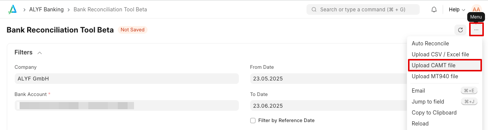
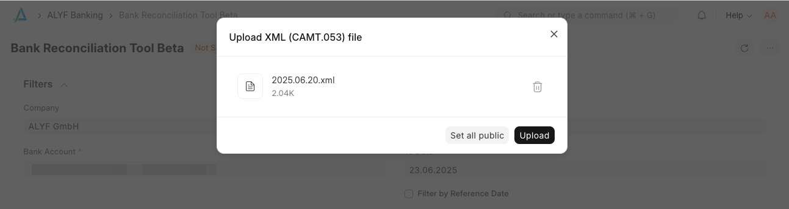

## Overview

The CAMT file upload feature provides a manual alternative to automated EBICS bank transaction synchronization. When EBICS integration is not available or not working properly, you can manually upload CAMT (Cash Management) XML files directly to import bank transactions into ERPNext.

## When to Use This Feature

Use the CAMT file upload feature when:

- Your bank doesn't support [EBICS integration](/app/docs/en/banking/ebics-integration)
- Temporary connectivity or authentication problems with EBICS
- You prefer to manually control when transactions are imported
- As a fallback when automated synchronization fails

## How It Works

The CAMT file upload feature uses the **same transaction processing mechanisms** as the automated EBICS integration. This means:

- Transaction data is processed identically to EBICS imports
- The same validation and error handling applies
- Bank transactions are created with the same format and structure
- Duplicate detection works the same way

## File Format Requirements

CAMT XML Files

- Must be valid CAMT (Cash Management) XML format
- Typically CAMT.052 (intraday) or CAMT.053 (booked transactions) formats
- Files should be in UTF-8 encoding

Many banks provide CAMT files as ZIP archives containing multiple XML files.

- Banks typically provide one XML file per day within a ZIP archive
- You must extract/unzip the files manually before upload
- Each XML file must be uploaded separately
- Do not upload the ZIP file directly - it will not work

## Step-by-Step Instructions

### 1. Obtain CAMT Files from Your Bank

1. Log into your bank's online banking system
2. Navigate to the export or download section
3. Download CAMT files (usually for a specific date range)
4. If files are provided as ZIP archives, extract them to individual XML files

### 2. Upload CAMT Files to ERPNext

1. Open ALYF's **Bank Reconciliation Beta** and select the _Bank Account_ you want to import transactions for
2. Look for the CAMT file upload option in the "..." menu

    

3. Select the extracted XML file from your computer

    

4. Click "Upload" to process the file

### 3. Review Imported Transactions

1. Navigate to **Bank Transaction** list
2. Verify that transactions have been imported correctly
3. Check for any error messages or failed imports
4. Process bank reconciliation as needed

## File Processing

- Each XML file is processed completely or not at all (atomic processing)
- Duplicate Bank Transactions (according to _Transaction ID_) are skipped
- If processing fails for any transaction, the entire file import is rolled back
- Error messages will be logged for troubleshooting

### Batch Entries and Sub-Transactions

CAMT files may contain batch entries with multiple sub-transactions (e.g. a bulk payment broken down into individual lines). Each sub-transaction receives a **unique transaction ID** based on:
1. The bank-provided `TxId` reference (if available)
2. A combination of the batch reference and a sub-transaction index
3. A hash of the transaction details as a fallback

> **Breaking change (v15-hotfix, Oct 2025):** Previously, batch sub-transactions could share the same ID, causing only the first line to be imported. After the fix, each sub-line gets a distinct ID. If you suspect missing sub-transactions from past imports, consider re-importing the affected CAMT files or EBICS requests.

## Common Issues

**File Upload Fails**
- Check file format - must be valid CAMT XML
- Ensure file is not corrupted during download/extraction
- Verify file encoding (should be UTF-8)

**Some Transactions Skipped**
- Pending (PDNG) and informational (INFO) transactions are automatically skipped
- Only booked (BOOK) transactions are imported
- Check transaction status in the CAMT file

**Permission Errors**
- Ensure your user has **Bank Transaction** create permissions
- Contact your system administrator if needed

## Best Practices

1. **Regular Processing**: Upload files regularly to keep transactions current
2. **File Organization**: Keep downloaded files organized by date for easy reference
3. **Backup Files**: Store original CAMT files as backup documentation
4. **Verify Imports**: Always review imported transactions before reconciliation
