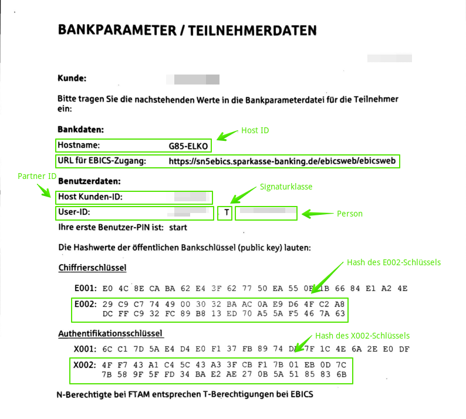
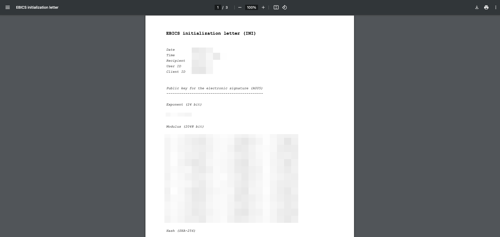
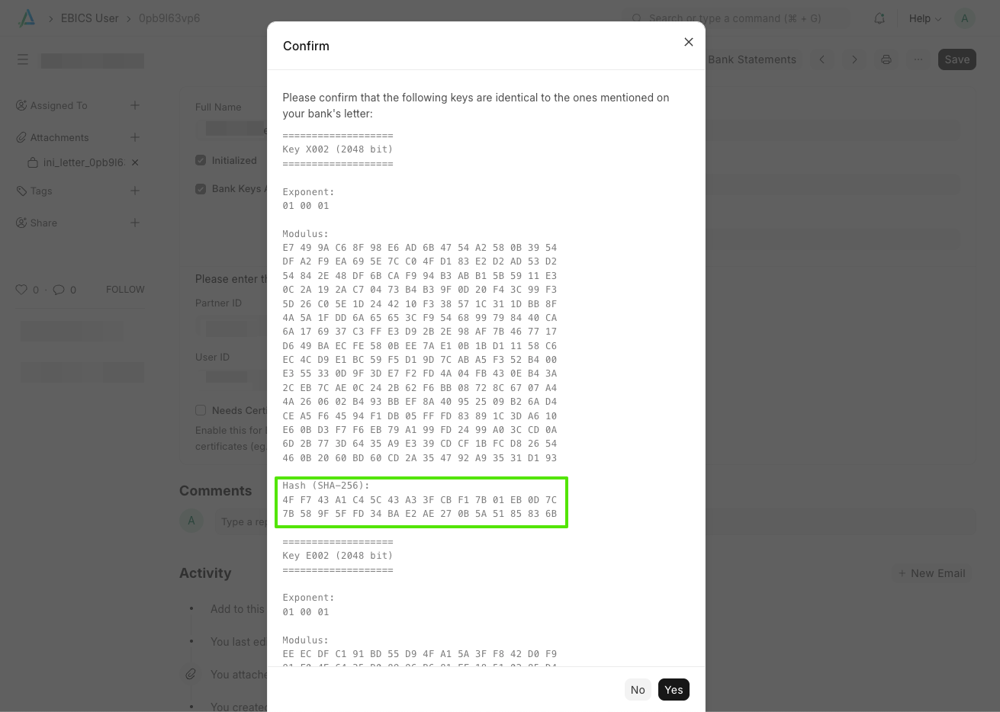

EBICS (Electronic Banking Internet Communication Standard) allows companies to manage payments across multiple banks using a single, secure system. Widely used in Europe, EBICS is an open standard compatible with many ERP systems, making it easy for businesses to handle multi-bank payments and cash management.

## Ask your bank for an EBICS access

Please contact your bank and ask for an EBICS access.

The access should have **signature class T**, meaning that you can only transfer documents but not sign them. This way, your ERPNext instance will be able to fetch your bank transactions, but cannot initiate any payments.

The following order types are required:

Type | Description | Remark
-----|-------------|:-----------
camt.053 | Bank statements for completed days | 
camt.052 | Intraday bank transactions | optional
camt.054 | Details for itemising bulk transfers | optional

Your bank may ask you to sign an agreement for the EBICS access. Your bank may charge a one-time fee as well as a monthly fee for this service. In our experience, the one-time fee is around 20,00 € and the monthly fee is around 8,00 €.

Once the agreement is signed, your bank will send a letter with the EBICS parameters to your address. This letter will contain the following information:

- Host ID / Hostname
- EBICS URL / URL für EBICS-Zugang
- Partner ID / Host Kunden-ID
- User ID
- Cipher key / Chiffrierschlüssel
- Authentication key / Authentifikationsschlüssel

Please make sure you have this information at hand before proceeding.

## Configure the Banking Settings

Please go to **Banking Settings** and enter the following information:

- _Admin URL_: https://banking.alyf.de
- _Enabled_: Activate this checkbox
- _Enable EBICS_: Activate this checkbox

Please fill in the following information we have sent you by email. If you didn't sign up yet, you can do so at [banking.alyf.de](https://banking.alyf.de/banking-pricing).

- _Customer ID_
- _Portal API Token_

The _Customer ID_ and _Portal API Token_ are used to identify your subscription and enables your ERPNext instance to communicate with our servers.

The fields _Fintech Licensee Name_ and _Fintech License Key_ are automatically fetched from our backend server. These are used for unlocking the ebics library, which is a proprietary third party software that we are licensing for you.

> [!NOTE]
> Neither we nor the developers of the ebics library will have access to your EBICS keys or your bank account data. All sensitive data is transferred directly between your ERPNext instance and your bank and stored only on your ERPNext instance.

## Set up the Bank

If you don't have one already, please create a new **Bank** in ERPNext and enter the following information:

- _Bank Name_: The name of your bank (doesn't have to be precise, use something easily recognizable)
- _EBICS Host ID_: The _Host ID_ from the bank's letter
- _EBICS URL_: The _EBICS URL_ from the bank's letter

If you already have a suitable **Bank** record, just edit it and fill in the EBICS information.

## Set up the Bank Account

If you don't have one already, please create a new **Bank Account** in ERPNext and enter the following information:

- _Account Name_: The name of the bank account (doesn't have to be precise, use something easily recognizable)
- _Is Company Account_: Activate this checkbox
- _Company_: Select the company that owns the bank account
- _Company Account_: Select accounting account that represents the bank account
- _Bank_: Select the **Bank** you created in the previous step
- _IBAN_: The IBAN of the bank account, without spaces. This is important for the EBICS communication, as it's used to identify the account from the data received from the bank.

If you already have a suitable **Bank Account** record, just make sure it matches the above requirements.

## Create a new EBICS User

Please create a new **EBICS User** in ERPNext and enter the following information:

- _Full Name_: The name of the person in whose name the EBICS access was granted
- _Company_: The company that owns the bank account
- _Bank Account_: The bank account you created above
- _Bank_: The bank you created above
- _Partner ID_: The _Partner ID_ from the bank's letter
- _User ID_: The _User ID_ from the bank's letter
- _Needs Certificate_: This is untested and should usually be left unchecked. If you are based in France, you may need to activate this option.
- _Download Batch Transactions_: If enabled, camt.054 files are downloaded alongside the regular camt.052/053 files and merged with them. This provides detailed line items for bulk transfers. Existing users who had _Split Batch Transactions_ enabled will have this activated automatically.

Please save the **EBICS User** record and click the "Initialize" button. You will be prompted to enter a _Passphrase_ and a _Signature Passphrase_. The _Passphrase_ is required to decrypt your keyring for any communication with the bank. The _Signature Passphrase_ is only required when uploading data to your bank.
You can optionally store the _Passphrase_ in ERPNext to enabled automated regular downloads of your bank statements. If you do not want to store your password, you'll be prompted every time it is required.
After setting you passwords, please click on "Initialize". This will create your keys for the EBICS communication and transmit them to your bank.

> [!NOTE]
> We will receive and store your _Host ID_, _Partner ID_, and _User ID_. We use this information to buy a license for the ebics library on your behalf. Once you delete the **EBICS User** record, we will at the same time revoke the license and delete the information from our servers.

### EBICS Initialization Letter

After clicking the "Initialize" button, you will find an "EBICS initialization letter" attached in the sidebar. Please sign this letter and send it to your bank (email or fax might be accepted). Your bank will use this letter to verify the keys that were transmitted electronically. Once the bank has verified the keys, you can proceed with the next steps.

### Verify Bank Keys

After the bank has verified the keys, it's your turn to verify the bank's keys. In the first letter you've received from your bank, you will find a fingerprint of the bank's keys. Please click on "Verify Bank Keys" in the **EBICS User** record. Your ERPNext instance will fetch the bank's keys and show them to you. Please compare the fingerprint with the one you received from the bank. If they match, click "Yes" to confirm the bank's keys. If they don't match, please click "No" and contact your bank.

If everything went well, you should see that the checkboxes _Initialized_ and _Bank Keys Activated_ are both enabled. This means you are now ready to download your bank statements.

## Download Bank Statements

> Before syncing your bank transactions, consider setting up ["Automatic Party Matching"](https://docs.erpnext.com/docs/user/manual/en/bank-reconciliation#3-2-3-automatic-party-matching-for-bank-transactions) to improve the bank reconciliation experience. Please go through the link to determine if this feature benefits your organization.

To manually fetch transactions, please open the **EBICS User** record and click on "Download Bank Statements". You'll see a popup where you can select the date range for the transactions you want to download. Please click "Submit" to start the download.

After a while (not more than a few minutes), you should see new entries in your **Bank Transaction** list.

The daily sync (camt.053) runs every 4 hours and checks whether a successful **EBICS Request** already exists for the previous day. If so, the sync is skipped for that user, avoiding duplicate downloads.

If you have _Intraday Sync_ (camt.052) enabled for your account, intraday transactions are fetched hourly during business hours (7:00–18:00, Mon–Fri).

> Swiss EBICS setups use order types Z52/Z53/Z54 instead of C52/C53/C54. This is handled automatically.

## Migrate from Klarna Kosma

If you are switching from our previous banking provider (Klarna Kosma) to EBICS, please take special care to ensure that the dates don't overlap. Both services use different transaction IDs. If you re-download date ranges via EBICS that have already been downloaded via Kosma, we cannot avoid duplicates.

Once your EBICS setup is complete, please set the _Start Date_ in your **EBICS User** and disable "Klarna Kosma" in the **Banking Settings**.

For example, let's assume the last sync via Klarna Kosma was for yesterday's transactions. Today, I verify my bank's keys and set the _Start Date_ to the current date. At the same time, I disable "Klarna Kosma" in the **Banking Settings**. Tomorrow, I can download today's bank statements via EBICS.

## EBICS Request

Each download creates an **EBICS Request** record that stores the raw response data and processing status.

### Re-Import

If transactions from a previous download need to be reprocessed (e.g. after a bug fix), you can click **Re-Import** on the **EBICS Request**. This re-runs the import logic using the stored response data without contacting the bank again.

> If _Download Batch Transactions_ is enabled, the re-import only covers the data stored on that specific request. Batch detail from a separate camt.054 request is not automatically included.

### Download Response Files

You can download the raw XML files from any **EBICS Request** by clicking **Download response files**. The files are packaged as a ZIP archive, useful for archiving or troubleshooting.

## Common issues

### No bank transactions downloaded

Possible error message: `EBICS_NO_DOWNLOAD_DATA_AVAILABLE`

This means that your bank has not made any account statements available, for the requested period. This can happen when:

- Your bank does not yet supply account statements in camt.053 format. Please ask them to enable these statements for your account.
- You're trying to download transactions for the current day, but the account statements are only made available for completed days. Try downloading bank statements for past dates.
- You have a staging site that uses the same EBICS User. Both sites try to download the data but the Bank responds only to the first request. If you want to use EBICS on your staging site, you need a second EBICS User. Otherwise, you should disable EBICS for your staging site via **Banking Settings** or (`common_`)`site_config.json`: `"disable_ebics": true`.

### Bank Account not found for IBAN

This message in you error log means that we received transactions from your bank, but a corresponding **Bank Account** has not been configured in ERPNext. See [Set up the Bank Account](/app/docs/en/banking/ebics-integration#set-up-the-bank-account).
