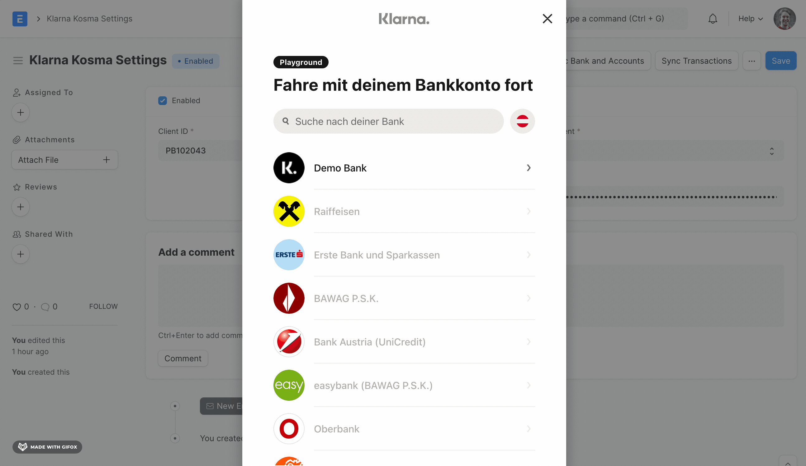

> [!WARNING]
> The "Klarna Kosma" integration will be discontinued at the end of 2024. Please use our [EBICS integration](/app/docs/en/banking/ebics-integration).

## Configure the Banking Settings

Go to **Banking Settings**:

- Check _Enabled_
- Fill in the _Customer ID_ and _Portal API Token_ you have received by email.

    If you don't have an API token yet, you can get one at [banking.alyf.de](https://banking.alyf.de/banking-pricing).

- Click the "Save" button and you are good to go!

## Fetching a Bank and Bank Accounts

> Before syncing your bank transactions, consider setting up ["Automatic Party Matching"](https://docs.erpnext.com/docs/user/manual/en/bank-reconciliation#3-2-3-automatic-party-matching-for-bank-transactions) to improve the bank reconciliation experience. Please go through the link to determine if this feature benefits your organization.

Click on the "Link Bank and Accounts" button on the settings page, and follow the prompts.

- Select the _Company_ who owns the bank account
- Set the _Start Date_ to the current date

    If you're planning to sync older transactions, please note that these will count against your transaction limit of the current billing period. If the _Start Date_ is left empty, the start of the fiscal year will be used.

- Click on "Continue"

Now you should see a screen where you can select your country and bank. Then you can enter your online banking credentials.

Test values for developers

- Select the country as `Deutschland`
- Select `Demo Bank`
- Select the Online Banking method as `Demo Bank PSD2`
- Username: `embedded`, Password: `12345`
- OTP: `12345`

For more test values and scenarios visit https://docs.openbanking.klarna.com/xs2a/test-bank-psd2.html

A **Bank** and **Bank Account** will be created automatically, the first time you complete the authorization flow.

> **Note:** This entire process of authentication with the Bank will be required once every quarter. More on this below.

## Fetching Bank Transactions

Bank Transactions can be manually or automatically fetched.

### Manually fetching transactions

Manually fetching transactions is currently only supported for one account at a time.

- Open the **Banking Settings**
- Click on "Sync" > "Transactions"
- Select the _Bank Account_ whose transactions should be fetched and click on "Sync".

The transactions are enqueued to be fetched in the background. This job could be time-consuming depending on the amount of transactions. After a while (not more than a few minutes), you should see new entries in your **Bank Transaction** list.

### Automatically fetching transactions

By default, a daily scheduled job will refresh **Bank Accounts**' data and fetch their transactions. This does not require any user intervention. The transactions can be seen in the **Bank Transactions** list.

> **Note:** The first bank transaction sync will consider the start date set while connecting your account.

## Bank Consent

Once you finish syncing **Bank** and **Bank Accounts** by entering your bank credentials, you have given the app consent to read your bank account's data for a limited time.

Consent is stored in the form of a **Bank Consent** record. The expiry date of the consent is also visible in the **Bank Consent** record.

#### What data am I consenting to share?

By providing consent, you will be sharing:

- A list of bank accounts associated with your online banking.
- Transaction details for each account (including reference numbers, account details, transaction amounts, counterparties, etc.) starting from the date you specified during initial setup.
- The balances of your bank accounts.

#### For how long is my consent valid?

Your consent will remain active for 90 days from its creation date, roughly equivalent to one quarter. During this period, there's no need for additional user intervention to retrieve data.

#### What should I do after the consent expires?

Once the consent period concludes, you'll need to renew your authorization. This can be done by [linking your Bank and Accounts](#fetching-a-bank-and-bank-accounts) via the **Banking Settings**.

#### How secure is this consent token?

The consent token, which facilitates ERPNext's authentication with your bank, is securely encrypted. It resides encrypted on your ERPNext instance, is always transferred through encrypted channels, and is refreshed after every transaction that employs it.

## Common errors

### BankingError: 'from_date' must be equal or after 'from_date' specified in consent scope

In the **Bank Account**, we store the _Last Integration Date_. When syncing transactions, we fetch only those transactions which are newer than the _Last Integration Date_. At the same time, the **Bank Conset** has a _Consent Start Date_. It cannot be used to fetch transactions prior to the start date. If, for some reason, the _Last Integration Date_ is older than the _Consent Start Date_, you'll see this error.

You can resolve this error by adjusting the _Last Integration Date_ in the **Bank Account** and/or re-connecting your bank account through **Banking Settings** > "Link Bank and Account".
