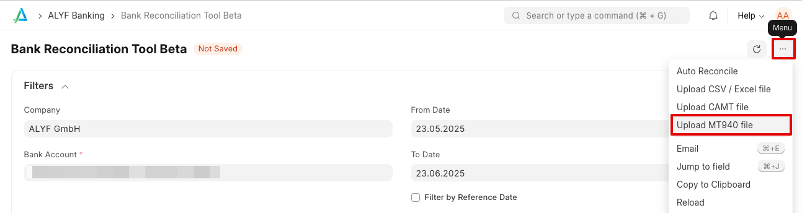
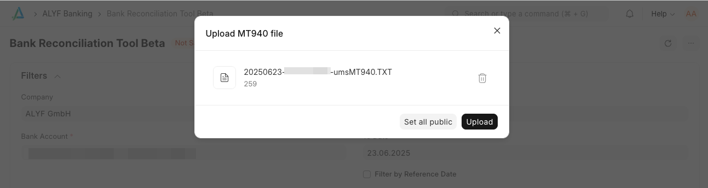

## Overview

The MT940 file upload feature provides a manual alternative to automated EBICS bank transaction synchronization. When EBICS integration is not available or not working properly, you can manually upload MT940 files directly to import bank transactions into ERPNext.

## When to Use This Feature

Use the MT940 file upload feature when:

- Your bank doesn't support [EBICS integration](/app/docs/en/banking/ebics-integration)
- Temporary connectivity or authentication problems with EBICS
- You prefer to manually control when transactions are imported
- As a fallback when automated synchronization fails
- Your bank provides MT940 format files instead of CAMT

## Transaction ID Differences

⚠️ CAMT and MT940 files use **different methods for generating transaction IDs**. This means:

- **Do not mix CAMT and MT940 imports** for the same bank account and time period
- Using both formats for the same transactions **will create duplicate bank transactions**
- Choose one format (CAMT or MT940) and stick with it consistently
- If you need to switch formats, ensure no overlapping transaction periods

## File Format Requirements

MT940 Files

- Must be valid MT940 format
- Standard SWIFT MT940 message format
- Files should be in UTF-8 encoding
- Common file extensions: `.mt940`, `.sta`, `.txt`, `.940`

File Handling

- Most banks provide MT940 files as individual text files
- Some banks may provide files in ZIP archives - extract them before upload
- Each MT940 file can contain multiple statements (days)
- Upload one file at a time
- Do not upload ZIP files directly - they will not work

Encoding

- The importer tries multiple character encodings (UTF-8, Latin-1, CP1252, etc.)
- Files from banks that don't use UTF-8 should import correctly without manual conversion

## Step-by-Step Instructions

### 1. Obtain MT940 Files from Your Bank

1. Log into your bank's online banking system
2. Navigate to the export or download section
3. Download MT940 files (usually for a specific date range)
4. If files are provided as ZIP archives, extract them to individual MT940/text files

### 2. Upload MT940 Files to ERPNext

1. Open ALYF's **Bank Reconciliation Beta** and select the _Bank Account_ you want to import transactions for
2. Look for the MT940 file upload option in the "..." menu

    

3. Select the MT940 file from your computer

    

4. Click "Upload" to process the file

### 3. Review Imported Transactions

1. Navigate to **Bank Transaction** list
2. Verify that transactions have been imported correctly
3. Check for any error messages or failed imports
4. Process bank reconciliation as needed

## File Processing

- Each MT940 file is processed completely or not at all (atomic processing)
- Duplicate Bank Transactions (based on generated transaction hash) are skipped
- If processing fails for any transaction, the entire file import is rolled back
- All statements within a single MT940 file are processed together

## Common Issues

**File Upload Fails**
- Check file format - must be valid MT940 format
- Ensure file is not corrupted during download/extraction
- Verify file encoding (try UTF-8 if there are encoding issues)
- Check that file extension is supported (`.sta`, `.mt940`, `.txt`, `.STA`, `.MT940`, `.940`, `.TXT`)

**Permission Errors**
- Ensure your user has **Bank Transaction** create permissions
- Contact your system administrator if needed

**Duplicate Transactions When Switching from CAMT**
- This is expected behavior due to different transaction ID generation
- Do not import the same time period with both CAMT and MT940 formats
- Choose one format and use it consistently

## Best Practices

1. **Consistent Format**: Choose either CAMT or MT940 and stick with it - do not mix formats
2. **Regular Processing**: Upload files regularly to keep transactions current
4. **Backup Files**: Store original MT940 files as backup documentation
5. **Verify Imports**: Always review imported transactions before reconciliation
6. **Avoid Overlaps**: When switching from CAMT to MT940 (or vice versa), ensure no overlapping transaction periods

## Technical Details

**Transaction ID Generation**
- MT940 transactions use a SHA-256 hash of transaction details as the transaction ID
- This differs from CAMT files which use bank-provided reference numbers if available
- Hash includes: date, IBAN, party name, reference, amount, currency, transaction type, and description
