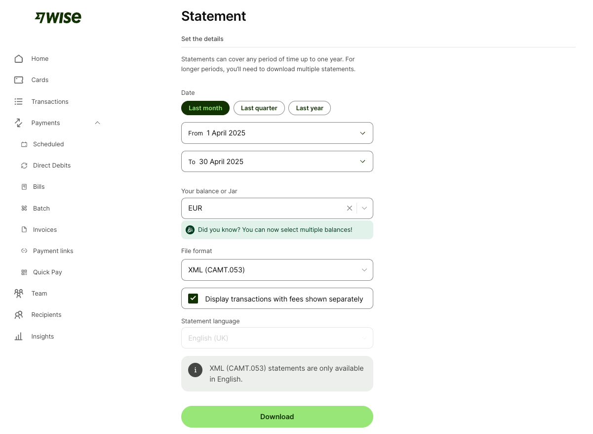
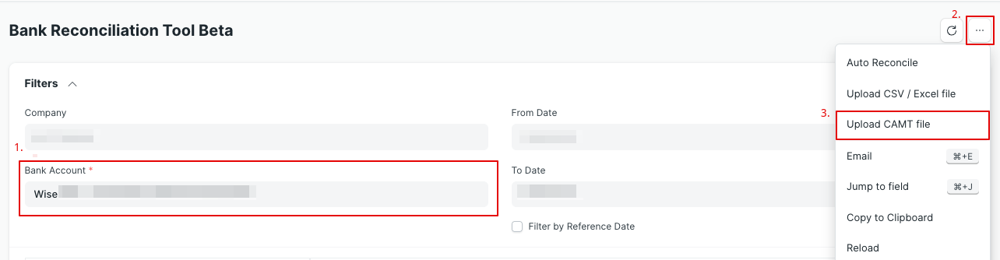

You can import your **Bank Transactions** from [WISE](https://wise.com/) and reconcile them using our **Bank Reconciliation Tool Beta**.

1. For the WISE jar or balance you want to connect, create an **Account** and a **Bank Account** in ERPNext. Make sure that the **Account** uses the same currency and the **Bank Account** has _Is Company Account_ enabled.
2. Go to https://wise.com/balances/statements/balance-statement, select an appropriate timespan, **one** jar or balance and the file format "XML (CAMT.053)".

    

3. In ERPNext, open **Bank Reconciliation Tool Beta** and select the appropriate **Bank Account**.
4. Open the top right "..." menu and select "Upload CAMT File"

    

5. The transactions from the file will be added as **Bank Transactions** against the selected **Bank Account** in ERPNext.

You can now go ahead with the bank reconciliation or import additional accounts.

> [!TIP]
> Reconciliation becomes much easier when you record receivables/payables in the same currency as the bank account that is used for payment.
